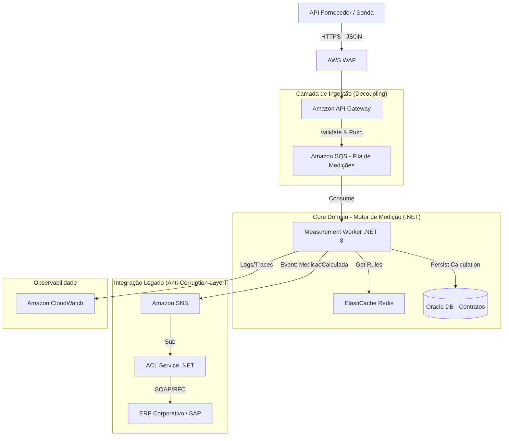

# Arquitetura de Referência: Sistema de Medição e Afretamento de Sondas (Oil & Gas)

Este projeto documenta a arquitetura de referência para um sistema de **Gestão de Medição Contratual**, focado no cenário de afretamento de sondas de perfuração (Rigs).

O objetivo da solução é automatizar o cálculo de pagamentos baseados em performance (Uptime/Downtime), aplicando regras contratuais complexas e integrando dados de terceiros com o ERP corporativo.

## 🏗️ O Desafio de Negócio
* **Complexidade:** Contratos de afretamento possuem cláusulas variáveis de penalidade por *Downtime*.
* **Integração:** Necessidade de ingerir Boletins Diários de Perfuração (BDP/DDR) vindos de fornecedores externos.
* **Compliance:** Todo cálculo precisa ser auditável e integrado ao sistema financeiro legado (ERP).

## 📐 Desenho da Solução (C4 Model - Container View)

A arquitetura utiliza uma abordagem **Event-Driven** para desacoplar a ingestão de dados (Sondas) do motor de cálculo financeiro, garantindo que o sistema legado não gargale a operação.

