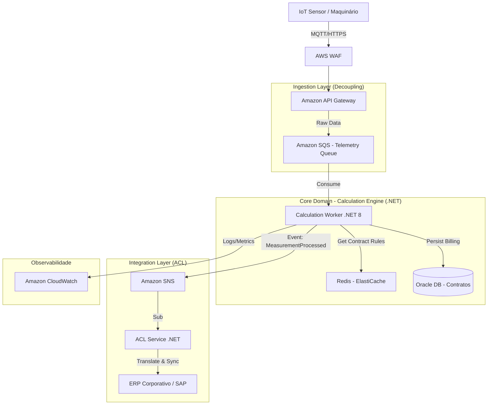

# Projeto 01: Sistema de Medição de Contratos e Telemetria IoT

Este projeto documenta a arquitetura de referência para um sistema de **Gestão de Ativos e Faturamento Baseado em Uso** (Usage-Based Billing), aplicado a um cenário de aluguel de maquinário pesado (ex: Guindastes, Escavadeiras Indústriais).

## 🏗️ O Desafio de Negócio (Contexto)
Uma empresa gerencia milhares de ativos alugados para terceiros. O faturamento é complexo e depende de:
1.  **Medição Real:** Ingestão de dados de telemetria (IoT) das máquinas a cada minuto.
2.  **Regras Contratuais:** Cláusulas de penalidade por *Downtime* (máquina parada) e bônus por produtividade.
3.  **Ambiente Híbrido:** Necessidade de integrar esses dados modernos com um ERP financeiro legado (On-Premise).

**Requisitos Não-Funcionais Críticos:**
* Garantia de entrega dos dados (Nenhuma medição pode ser perdida, pois representa dinheiro).
* Desacoplamento entre a alta volumetria da IoT e a lentidão do ERP legado.

## 📐 Arquitetura da Solução (C4 Model - Container View)

A solução adota uma arquitetura **Event-Driven** para garantir resiliência na ingestão e uma **Anti-Corruption Layer (ACL)** para proteger o domínio moderno do legado.

## 🛠️ Padrões de Arquitetura Aplicados
* **Event-Driven Architecture:** Uso de filas (SQS) para desacoplar a ingestão de dados da telemetria do processamento e integração com o ERP.
* **Anti-Corruption Layer (ACL):** Serviço dedicado para traduzir e adaptar os dados do domínio moderno para o legado, evitando contaminação do modelo.
* **Caching Strategy:** Utilização de Redis para armazenar regras contratuais frequentemente acessadas, reduzindo latência e carga no banco Oracle.
* **Resiliência & Observabilidade:** Implementação de monitoramento via CloudWatch para garantir a saúde do sistema e alertas proativos.