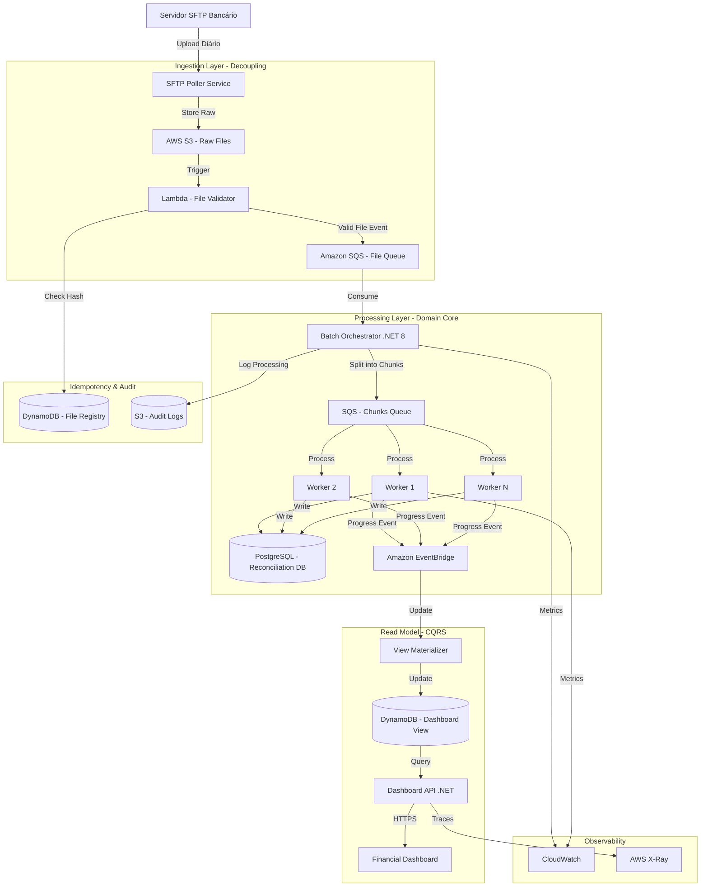

# Solução: Conciliação Financeira de Alta Volumetria

> 📌 **[← Voltar para o Problema](./README.md)**

---

## 📐 Solução Proposta (Arquitetura Event-Driven + Batch Processing)

### Decisões Arquiteturais (ADR)

#### ADR-001: Estratégia de Processamento - Event-Driven Batch
**Contexto:** Processar 2M de transações em < 1 hora, com resiliência e observabilidade.

**Decisão:** Utilizar uma arquitetura híbrida combinando:
- **Event-Driven** para desacoplar ingestão do processamento
- **Batch Processing** para processar chunks de dados em paralelo
- **CQRS** para separar escrita (processamento) de leitura (dashboard)

**Consequências:**
- ✅ Escalabilidade horizontal (múltiplos workers)
- ✅ Resiliência (falha em um chunk não afeta outros)
- ✅ Observabilidade (eventos de progresso para dashboard)
- ⚠️ Complexidade adicional na orquestração

#### ADR-002: Isolamento de Banco de Dados
**Contexto:** Evitar impacto no banco operacional durante processamento massivo.

**Decisão:** Implementar **Database per Service** com banco dedicado para conciliação.

**Consequências:**
- ✅ Zero impacto na operação online
- ✅ Otimização específica para cargas analíticas
- ⚠️ Necessidade de sincronização de dados transacionais

#### ADR-003: Garantia de Idempotência
**Contexto:** Evitar reprocessamento duplicado de arquivos.

**Decisão:** Utilizar **Content Hash (SHA-256)** como identificador único do arquivo.

**Consequências:**
- ✅ Detecção automática de arquivos duplicados
- ✅ Rastreabilidade completa
- ✅ Suporte a reprocessamento manual seguro

---

## 🏗️ Desenho da Solução (C4 Model - Container View)



---

## 🛠️ Padrões de Arquitetura Aplicados

### 1. **Event-Driven Architecture**
- **Problema:** Processamento monolítico bloqueante
- **Solução:** Eventos assíncronos entre ingestão, processamento e visualização
- **Benefício:** Desacoplamento total, resiliência a falhas parciais

### 2. **CQRS (Command Query Responsibility Segregation)**
- **Problema:** Dashboard travando durante processamento massivo
- **Solução:** Banco otimizado para escrita (PostgreSQL) + banco otimizado para leitura (DynamoDB)
- **Benefício:** Dashboard sempre responsivo, queries otimizadas

### 3. **Chunk Processing Pattern**
- **Problema:** Arquivo com 2M linhas não cabe na memória, falha = restart total
- **Solução:** Dividir arquivo em chunks de 10K registros processados independentemente
- **Benefício:** Processamento paralelo, falha isolada por chunk

### 4. **Idempotent Consumer**
- **Problema:** Arquivo reprocessado duplica dados
- **Solução:** Hash SHA-256 do conteúdo + tabela de registro de processamentos
- **Benefício:** Segurança para reprocessamento, auditoria completa

### 5. **Dead Letter Queue (DLQ)**
- **Problema:** Chunks com erro travando a fila
- **Solução:** Após 3 tentativas, chunk vai para DLQ para análise posterior
- **Benefício:** Processamento não para, time pode analisar erros depois

---

## 💻 Implementação - Exemplo de Código Limpo

### Domain Model (Clean Architecture)

```csharp
// Domain/Entities/TransactionRecord.cs
public sealed class TransactionRecord
{
    public Guid Id { get; private set; }
    public string TransactionId { get; private set; }
    public decimal Amount { get; private set; }
    public DateTime ProcessedAt { get; private set; }
    public ReconciliationStatus Status { get; private set; }

    private TransactionRecord() { } // EF Core

    public static Result<TransactionRecord> Create(
        string transactionId, 
        decimal amount)
    {
        if (string.IsNullOrWhiteSpace(transactionId))
            return Result.Failure<TransactionRecord>("Transaction ID is required");
        
        if (amount <= 0)
            return Result.Failure<TransactionRecord>("Amount must be positive");

        return Result.Success(new TransactionRecord
        {
            Id = Guid.NewGuid(),
            TransactionId = transactionId,
            Amount = amount,
            ProcessedAt = DateTime.UtcNow,
            Status = ReconciliationStatus.Pending
        });
    }

    public void MarkAsReconciled() => Status = ReconciliationStatus.Reconciled;
    public void MarkAsDivergent(string reason) => Status = ReconciliationStatus.Divergent;
}

public enum ReconciliationStatus
{
    Pending,
    Reconciled,
    Divergent
}
```

### Application Service (Use Case)

```csharp
// Application/UseCases/ProcessReconciliationChunk.cs
public sealed class ProcessReconciliationChunkHandler 
    : IRequestHandler<ProcessReconciliationChunkCommand, Result>
{
    private readonly IReconciliationRepository _repository;
    private readonly IEventPublisher _eventPublisher;
    private readonly ILogger<ProcessReconciliationChunkHandler> _logger;

    public ProcessReconciliationChunkHandler(
        IReconciliationRepository repository,
        IEventPublisher eventPublisher,
        ILogger<ProcessReconciliationChunkHandler> logger)
    {
        _repository = repository;
        _eventPublisher = eventPublisher;
        _logger = logger;
    }

    public async Task<Result> Handle(
        ProcessReconciliationChunkCommand request, 
        CancellationToken cancellationToken)
    {
        _logger.LogInformation(
            "Processing chunk {ChunkId} from file {FileId}", 
            request.ChunkId, 
            request.FileId);

        var transactions = await _repository
            .GetTransactionsByIds(request.TransactionIds, cancellationToken);

        var processedCount = 0;
        var divergentCount = 0;

        foreach (var line in request.FileLines)
        {
            var parsed = ParseFlatFileLine(line);
            if (parsed.IsFailure)
            {
                _logger.LogWarning("Failed to parse line: {Line}", line);
                continue;
            }

            var transaction = transactions
                .FirstOrDefault(t => t.TransactionId == parsed.Value.TransactionId);

            if (transaction is null)
            {
                divergentCount++;
                await _eventPublisher.PublishAsync(
                    new DivergenceDetectedEvent(parsed.Value.TransactionId), 
                    cancellationToken);
                continue;
            }

            if (transaction.Amount == parsed.Value.Amount)
            {
                transaction.MarkAsReconciled();
                processedCount++;
            }
            else
            {
                transaction.MarkAsDivergent("Amount mismatch");
                divergentCount++;
            }
        }

        await _repository.SaveChangesAsync(cancellationToken);

        await _eventPublisher.PublishAsync(
            new ChunkProcessedEvent(
                request.ChunkId, 
                processedCount, 
                divergentCount), 
            cancellationToken);

        return Result.Success();
    }

    private Result<ParsedTransaction> ParseFlatFileLine(string line)
    {
        // Implementação de parsing de arquivo posicional
        // Exemplo: posições 1-20 = TransactionId, 21-35 = Amount
        if (line.Length < 35)
            return Result.Failure<ParsedTransaction>("Invalid line format");

        var transactionId = line.Substring(0, 20).Trim();
        var amountStr = line.Substring(20, 15).Trim();

        if (!decimal.TryParse(amountStr, out var amount))
            return Result.Failure<ParsedTransaction>("Invalid amount format");

        return Result.Success(new ParsedTransaction(transactionId, amount));
    }
}

public record ParsedTransaction(string TransactionId, decimal Amount);
```

### Infrastructure - Idempotency Guard

```csharp
// Infrastructure/Services/IdempotencyService.cs
public sealed class IdempotencyService : IIdempotencyService
{
    private readonly IAmazonDynamoDB _dynamoDB;
    private readonly ILogger<IdempotencyService> _logger;
    private const string TableName = "FileProcessingRegistry";

    public async Task<bool> IsAlreadyProcessedAsync(
        string filePath, 
        string contentHash, 
        CancellationToken cancellationToken)
    {
        var request = new GetItemRequest
        {
            TableName = TableName,
            Key = new Dictionary<string, AttributeValue>
            {
                { "FileHash", new AttributeValue { S = contentHash } }
            }
        };

        var response = await _dynamoDB.GetItemAsync(request, cancellationToken);
        
        if (response.Item.Count == 0)
            return false;

        _logger.LogWarning(
            "File {FilePath} with hash {Hash} already processed", 
            filePath, 
            contentHash);

        return true;
    }

    public async Task RegisterProcessingAsync(
        string filePath, 
        string contentHash, 
        CancellationToken cancellationToken)
    {
        var request = new PutItemRequest
        {
            TableName = TableName,
            Item = new Dictionary<string, AttributeValue>
            {
                { "FileHash", new AttributeValue { S = contentHash } },
                { "FilePath", new AttributeValue { S = filePath } },
                { "ProcessedAt", new AttributeValue { S = DateTime.UtcNow.ToString("O") } },
                { "TTL", new AttributeValue { N = DateTimeOffset.UtcNow.AddDays(90).ToUnixTimeSeconds().ToString() } }
            }
        };

        await _dynamoDB.PutItemAsync(request, cancellationToken);
    }
}
```

### Batch Orchestrator - Core Logic

```csharp
// Infrastructure/Services/BatchOrchestrator.cs
public sealed class BatchOrchestrator : BackgroundService
{
    private readonly IAmazonSQS _sqs;
    private readonly IS3Client _s3;
    private readonly IIdempotencyService _idempotency;
    private readonly ILogger<BatchOrchestrator> _logger;
    private const string FileQueueUrl = "https://sqs.us-east-1.amazonaws.com/xxx/file-queue";
    private const string ChunkQueueUrl = "https://sqs.us-east-1.amazonaws.com/xxx/chunk-queue";
    private const int ChunkSize = 10000;

    protected override async Task ExecuteAsync(CancellationToken stoppingToken)
    {
        while (!stoppingToken.IsCancellationRequested)
        {
            var messages = await _sqs.ReceiveMessageAsync(
                new ReceiveMessageRequest
                {
                    QueueUrl = FileQueueUrl,
                    MaxNumberOfMessages = 1,
                    WaitTimeSeconds = 20
                }, stoppingToken);

            foreach (var message in messages.Messages)
            {
                await ProcessFileMessageAsync(message, stoppingToken);
                await _sqs.DeleteMessageAsync(FileQueueUrl, message.ReceiptHandle, stoppingToken);
            }
        }
    }

    private async Task ProcessFileMessageAsync(Message message, CancellationToken cancellationToken)
    {
        var fileEvent = JsonSerializer.Deserialize<FileUploadedEvent>(message.Body);
        
        _logger.LogInformation("Processing file {FileName}", fileEvent.FileName);

        // 1. Download file from S3
        var fileContent = await _s3.DownloadFileAsync(fileEvent.S3Key, cancellationToken);
        
        // 2. Calculate hash for idempotency
        var contentHash = CalculateSHA256(fileContent);
        
        if (await _idempotency.IsAlreadyProcessedAsync(fileEvent.S3Key, contentHash, cancellationToken))
        {
            _logger.LogWarning("File {FileName} already processed, skipping", fileEvent.FileName);
            return;
        }

        // 3. Split into chunks
        var lines = fileContent.Split('\n');
        var chunks = lines.Chunk(ChunkSize).ToList();
        
        _logger.LogInformation("File split into {ChunkCount} chunks", chunks.Count);

        // 4. Send each chunk to processing queue
        var chunkId = 0;
        foreach (var chunk in chunks)
        {
            var chunkEvent = new ChunkCreatedEvent
            {
                FileId = fileEvent.FileId,
                ChunkId = chunkId++,
                Lines = chunk.ToArray(),
                TotalChunks = chunks.Count
            };

            await _sqs.SendMessageAsync(new SendMessageRequest
            {
                QueueUrl = ChunkQueueUrl,
                MessageBody = JsonSerializer.Serialize(chunkEvent)
            }, cancellationToken);
        }

        // 5. Register as processed
        await _idempotency.RegisterProcessingAsync(
            fileEvent.S3Key, 
            contentHash, 
            cancellationToken);
    }

    private static string CalculateSHA256(string content)
    {
        using var sha256 = SHA256.Create();
        var bytes = Encoding.UTF8.GetBytes(content);
        var hash = sha256.ComputeHash(bytes);
        return Convert.ToBase64String(hash);
    }
}
```

---

## 📊 Análise de Performance

### Antes (Monolítico)
- **Tempo:** 6+ horas
- **Throughput:** ~92 registros/segundo
- **Resiliência:** Falha = restart total
- **Visibilidade:** Zero em tempo real

### Depois (Event-Driven)
- **Tempo:** < 1 hora (target: 45 minutos)
- **Throughput:** ~740 registros/segundo (8 workers)
- **Resiliência:** Falha isolada por chunk (10K registros)
- **Visibilidade:** Dashboard atualizado a cada chunk processado

### Cálculo de Capacidade
```
2.000.000 registros ÷ 10.000 (chunk size) = 200 chunks
200 chunks ÷ 8 workers = 25 chunks/worker
25 chunks × 3 minutos/chunk = 75 minutos ÷ 60 = 1.25 horas

Com otimização (2 min/chunk): ~50 minutos ✅
```

### Estimativa de Custos AWS (mensal)
- **S3:** ~$50 (1TB storage + requests)
- **SQS:** ~$20 (1M mensagens/dia)
- **Lambda:** ~$30 (validação)
- **EC2 (Workers):** ~$400 (8 × t3.medium spot instances)
- **RDS PostgreSQL:** ~$200 (db.t3.large)
- **DynamoDB:** ~$50 (on-demand)
- **CloudWatch:** ~$50

**Total:** ~$800/mês (vs. custo de indisponibilidade = incalculável)

---

## 🔐 Considerações de Segurança

### 1. **Encryption at Rest**
```hcl
# Terraform - S3 Bucket
resource "aws_s3_bucket_server_side_encryption_configuration" "raw_files" {
  bucket = aws_s3_bucket.raw_files.id

  rule {
    apply_server_side_encryption_by_default {
      sse_algorithm     = "aws:kms"
      kms_master_key_id = aws_kms_key.reconciliation.arn
    }
  }
}
```

### 2. **IAM Least Privilege**
```json
{
  "Version": "2012-10-17",
  "Statement": [
    {
      "Effect": "Allow",
      "Action": [
        "s3:GetObject"
      ],
      "Resource": "arn:aws:s3:::reconciliation-raw/*",
      "Condition": {
        "StringEquals": {
          "s3:ExistingObjectTag/Processed": "false"
        }
      }
    }
  ]
}
```

### 3. **Audit Trail Completo**
- Hash do arquivo registrado no DynamoDB
- Logs estruturados no CloudWatch
- Arquivos brutos mantidos no S3 Glacier por 7 anos
- Rastreamento de quem processou e quando

---

## 🎯 Próximos Passos (Roadmap)

### **Fase 1 - MVP (Sprints 1-2)**
- [ ] Setup de infraestrutura AWS (Terraform)
- [ ] Implementar SFTP Poller → S3
- [ ] Lambda de validação + hash
- [ ] Batch Orchestrator
- [ ] 3 Workers iniciais
- [ ] Idempotency com DynamoDB
- [ ] Testes de carga (1M registros)

### **Fase 2 - Observabilidade (Sprint 3)**
- [ ] Dashboard básico (Grafana + DynamoDB)
- [ ] Métricas customizadas no CloudWatch
- [ ] Alertas SNS para divergências > 5%
- [ ] Distributed tracing com X-Ray

### **Fase 3 - Otimizações (Sprint 4+)**
- [ ] Auto-scaling de workers baseado em fila
- [ ] Processamento paralelo de múltiplos arquivos
- [ ] Cache de regras contratuais no Redis
- [ ] ML para detecção de anomalias (SageMaker)

### **Fase 4 - Real-Time (Futuro)**
- [ ] Substituir batch por Kinesis Streams
- [ ] Processamento D+0 em near real-time
- [ ] API GraphQL para consultas ad-hoc

---

## 🧪 Estratégia de Testes

### 1. **Unit Tests (Domain + Application)**
```csharp
public class TransactionRecordTests
{
    [Fact]
    public void Create_WithValidData_ShouldSucceed()
    {
        // Arrange & Act
        var result = TransactionRecord.Create("TXN-001", 100.50m);

        // Assert
        result.IsSuccess.Should().BeTrue();
        result.Value.TransactionId.Should().Be("TXN-001");
        result.Value.Status.Should().Be(ReconciliationStatus.Pending);
    }

    [Fact]
    public void Create_WithInvalidAmount_ShouldFail()
    {
        // Arrange & Act
        var result = TransactionRecord.Create("TXN-001", -10m);

        // Assert
        result.IsFailure.Should().BeTrue();
        result.Error.Should().Contain("positive");
    }
}
```

### 2. **Integration Tests (Repository)**
```csharp
public class ReconciliationRepositoryTests : IClassFixture<DatabaseFixture>
{
    [Fact]
    public async Task SaveChanges_WithValidTransaction_ShouldPersist()
    {
        // Arrange
        var transaction = TransactionRecord.Create("TXN-002", 500m).Value;
        await _repository.AddAsync(transaction);

        // Act
        await _repository.SaveChangesAsync();

        // Assert
        var saved = await _repository.GetByIdAsync(transaction.Id);
        saved.Should().NotBeNull();
    }
}
```

### 3. **Load Tests (Locust/K6)**
```python
# locust_test.py
from locust import HttpUser, task, between

class ChunkProcessingUser(HttpUser):
    wait_time = between(1, 3)
    
    @task
    def process_chunk(self):
        self.client.post("/api/chunks", json={
            "chunkId": 1,
            "fileId": "test-file",
            "lines": ["TXN-001" + " " * 15 + "100.50"] * 10000
        })
```

---

## 📚 Referências & Recursos

### Livros
- **"Enterprise Integration Patterns"** - Gregor Hohpe (Messaging patterns)
- **"Building Event-Driven Microservices"** - Adam Bellemare
- **"Clean Architecture"** - Robert C. Martin

### AWS Documentation
- [SQS Best Practices](https://docs.aws.amazon.com/AWSSimpleQueueService/latest/SQSDeveloperGuide/sqs-best-practices.html)
- [S3 Event Notifications](https://docs.aws.amazon.com/AmazonS3/latest/userguide/NotificationHowTo.html)
- [DynamoDB Conditional Writes](https://docs.aws.amazon.com/amazondynamodb/latest/developerguide/WorkingWithItems.html#WorkingWithItems.ConditionalUpdate)

### Patterns
- [Chunk Processing Pattern](https://www.enterpriseintegrationpatterns.com/patterns/messaging/ChunkProcessing.html)
- [Idempotent Receiver](https://www.enterpriseintegrationpatterns.com/patterns/messaging/IdempotentReceiver.html)
- [Dead Letter Channel](https://www.enterpriseintegrationpatterns.com/patterns/messaging/DeadLetterChannel.html)

---

> 📌 **[← Voltar para o Problema](./README.md)**
