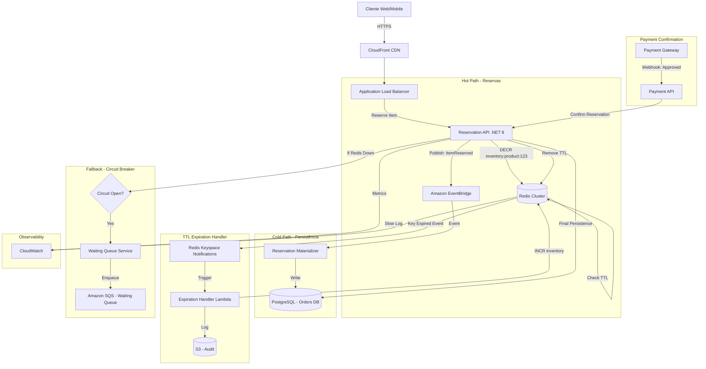

# Solução: Reserva de Estoque em Alta Concorrência

> 📌 **[← Voltar para o Problema](./README.md)**

---

## 📐 Solução Proposta (Redis + Distributed Locking + TTL)

### Decisões Arquiteturais (ADR)

#### ADR-001: Redis como Store de Reservas
**Contexto:** Precisamos de 10k req/s com integridade absoluta e TTL automático.

**Decisão:** Utilizar **Redis** como fonte da verdade para reservas ativas, com sincronização eventual para PostgreSQL.

**Consequências:**
- ✅ Performance: Redis suporta 100k+ ops/s em single-thread
- ✅ TTL nativo: EXPIRE integrado
- ✅ Atomic Operations: DECR/INCR garantem integridade
- ✅ Distributed Locking: RedLock algorithm
- ⚠️ Necessidade de sincronização com banco relacional para persistência

**Alternativas Rejeitadas:**
- ❌ PostgreSQL com SELECT FOR UPDATE: Locks bloqueiam, degradam performance
- ❌ MongoDB: Não tem operações atômicas tão performáticas quanto Redis
- ❌ DynamoDB: Latência maior que Redis, custo elevado para volumetria

#### ADR-002: Pattern de Reserva em Duas Fases (2PC Simplificado)
**Contexto:** Reserva != Compra finalizada. Precisamos liberar estoque de carrinhos abandonados.

**Decisão:** Implementar fluxo em 2 fases:
1. **Fase 1 - Reserva Temporária (TTL 10min):** Decrementa contador no Redis
2. **Fase 2 - Confirmação:** Persiste no PostgreSQL ao finalizar pagamento

**Consequências:**
- ✅ Zero overselling
- ✅ Libera automaticamente estoque abandonado
- ✅ Separação de concerns (hot path vs. cold path)
- ⚠️ Complexidade adicional na reconciliação

#### ADR-003: Circuit Breaker para Degradação Controlada
**Contexto:** Se Redis cair, sistema inteiro não pode parar.

**Decisão:** Implementar **Circuit Breaker** com fallback para modo "fila de espera".

**Consequências:**
- ✅ Resiliência: Sistema degrada mas não quebra
- ✅ Transparência: Usuário vê mensagem clara ("Aguarde na fila")
- ⚠️ Necessidade de implementar fallback logic

---

## 🏗️ Desenho da Solução (C4 Model - Container View)



---

## 🛠️ Padrões de Arquitetura Aplicados

### 1. **Distributed Locking (RedLock)**
- **Problema:** Múltiplos servidores tentando decrementar contador simultaneamente
- **Solução:** Redis atomic operations (DECR) + RedLock para operações complexas
- **Benefício:** Integridade garantida mesmo em cluster

### 2. **TTL (Time-to-Live) Pattern**
- **Problema:** Carrinhos abandonados travando estoque
- **Solução:** Redis EXPIRE + Keyspace Notifications
- **Benefício:** Liberação automática sem cronjobs

### 3. **Circuit Breaker Pattern**
- **Problema:** Redis down = sistema inteiro down
- **Solução:** Polly Circuit Breaker com fallback para fila
- **Benefício:** Degradação controlada, usuário não vê erro 500

### 4. **Event-Driven Architecture**
- **Problema:** Sincronização síncrona com PostgreSQL degrada performance
- **Solução:** Eventos assíncronos para persistência
- **Benefício:** Hot path ultra-rápido (< 50ms)

### 5. **Cache-Aside Pattern**
- **Problema:** Consultas ao PostgreSQL para verificar estoque
- **Solução:** Redis como cache com sincronização eventual
- **Benefício:** Leituras ultra-rápidas

---

## 💻 Implementação - Código Limpo

### Domain Model (DDD)

```csharp
// Domain/Entities/Reservation.cs
public sealed class Reservation
{
    public Guid Id { get; private set; }
    public string ProductId { get; private set; }
    public string UserId { get; private set; }
    public int Quantity { get; private set; }
    public DateTime ReservedAt { get; private set; }
    public DateTime? ConfirmedAt { get; private set; }
    public ReservationStatus Status { get; private set; }

    private Reservation() { }

    public static Result<Reservation> Create(string productId, string userId, int quantity)
    {
        if (string.IsNullOrWhiteSpace(productId))
            return Result.Failure<Reservation>("Product ID is required");
        
        if (quantity <= 0)
            return Result.Failure<Reservation>("Quantity must be positive");

        return Result.Success(new Reservation
        {
            Id = Guid.NewGuid(),
            ProductId = productId,
            UserId = userId,
            Quantity = quantity,
            ReservedAt = DateTime.UtcNow,
            Status = ReservationStatus.Pending
        });
    }

    public Result Confirm()
    {
        if (Status != ReservationStatus.Pending)
            return Result.Failure("Cannot confirm non-pending reservation");

        if (DateTime.UtcNow - ReservedAt > TimeSpan.FromMinutes(10))
            return Result.Failure("Reservation expired");

        Status = ReservationStatus.Confirmed;
        ConfirmedAt = DateTime.UtcNow;
        return Result.Success();
    }

    public void Expire()
    {
        Status = ReservationStatus.Expired;
    }
}

public enum ReservationStatus
{
    Pending,
    Confirmed,
    Expired
}
```

### Application Service - Reserva Atômica

```csharp
// Application/UseCases/ReserveInventory.cs
public sealed class ReserveInventoryHandler : IRequestHandler<ReserveInventoryCommand, Result<ReservationDto>>
{
    private readonly IRedisService _redis;
    private readonly IEventPublisher _eventPublisher;
    private readonly ILogger<ReserveInventoryHandler> _logger;
    private const int ReservationTTLSeconds = 600; // 10 minutos

    public async Task<Result<ReservationDto>> Handle(
        ReserveInventoryCommand request, 
        CancellationToken cancellationToken)
    {
        var inventoryKey = $"inventory:product:{request.ProductId}";
        var reservationKey = $"reservation:{request.UserId}:{request.ProductId}";

        _logger.LogInformation(
            "Attempting to reserve {Quantity} units of product {ProductId} for user {UserId}",
            request.Quantity, request.ProductId, request.UserId);

        // 1. Verificar se usuário já tem reserva ativa (idempotência)
        var existingReservation = await _redis.GetAsync<string>(reservationKey);
        if (!string.IsNullOrEmpty(existingReservation))
        {
            _logger.LogWarning("User {UserId} already has active reservation", request.UserId);
            return Result.Failure<ReservationDto>("You already have an active reservation for this product");
        }

        // 2. Tentar decrementar estoque atomicamente
        var remainingStock = await _redis.DecrementAsync(inventoryKey, request.Quantity);

        // 3. Verificar se ainda há estoque
        if (remainingStock < 0)
        {
            // Rollback: incrementar de volta
            await _redis.IncrementAsync(inventoryKey, request.Quantity);
            
            _logger.LogWarning(
                "Insufficient stock for product {ProductId}. Current: {Stock}",
                request.ProductId, remainingStock + request.Quantity);

            return Result.Failure<ReservationDto>("Product out of stock");
        }

        // 4. Criar reserva com TTL
        var reservation = Reservation.Create(
            request.ProductId, 
            request.UserId, 
            request.Quantity).Value;

        await _redis.SetAsync(
            reservationKey, 
            reservation.Id.ToString(), 
            TimeSpan.FromSeconds(ReservationTTLSeconds));

        // 5. Publicar evento para persistência assíncrona
        await _eventPublisher.PublishAsync(
            new InventoryReservedEvent(
                reservation.Id,
                request.ProductId,
                request.UserId,
                request.Quantity,
                DateTime.UtcNow.AddSeconds(ReservationTTLSeconds)),
            cancellationToken);

        _logger.LogInformation(
            "Successfully reserved {Quantity} units. Remaining stock: {Stock}",
            request.Quantity, remainingStock);

        return Result.Success(new ReservationDto
        {
            ReservationId = reservation.Id,
            ExpiresAt = DateTime.UtcNow.AddSeconds(ReservationTTLSeconds),
            RemainingStock = (int)remainingStock
        });
    }
}
```

### Infrastructure - Redis Service com Circuit Breaker

```csharp
// Infrastructure/Services/RedisService.cs
public sealed class RedisService : IRedisService
{
    private readonly IConnectionMultiplexer _redis;
    private readonly IAsyncPolicy<long> _circuitBreakerPolicy;
    private readonly ILogger<RedisService> _logger;

    public RedisService(
        IConnectionMultiplexer redis,
        ILogger<RedisService> logger)
    {
        _redis = redis;
        _logger = logger;

        // Circuit Breaker: 3 falhas consecutivas = abre por 30s
        _circuitBreakerPolicy = Policy<long>
            .Handle<RedisException>()
            .CircuitBreakerAsync(
                handledEventsAllowedBeforeBreaking: 3,
                durationOfBreak: TimeSpan.FromSeconds(30),
                onBreak: (result, duration) =>
                {
                    _logger.LogError(
                        "Circuit breaker opened for {Duration}s due to Redis failures",
                        duration.TotalSeconds);
                },
                onReset: () => _logger.LogInformation("Circuit breaker reset"),
                onHalfOpen: () => _logger.LogInformation("Circuit breaker half-open"));
    }

    public async Task<long> DecrementAsync(string key, int amount = 1)
    {
        try
        {
            return await _circuitBreakerPolicy.ExecuteAsync(async () =>
            {
                var db = _redis.GetDatabase();
                return await db.StringDecrementAsync(key, amount);
            });
        }
        catch (BrokenCircuitException ex)
        {
            _logger.LogError(ex, "Circuit breaker is open, falling back");
            throw new ServiceDegradedException("Inventory service temporarily unavailable", ex);
        }
    }

    public async Task<long> IncrementAsync(string key, int amount = 1)
    {
        var db = _redis.GetDatabase();
        return await db.StringIncrementAsync(key, amount);
    }

    public async Task<T?> GetAsync<T>(string key)
    {
        var db = _redis.GetDatabase();
        var value = await db.StringGetAsync(key);
        
        if (value.IsNullOrEmpty)
            return default;

        return JsonSerializer.Deserialize<T>(value!);
    }

    public async Task SetAsync<T>(string key, T value, TimeSpan? expiry = null)
    {
        var db = _redis.GetDatabase();
        var serialized = JsonSerializer.Serialize(value);
        await db.StringSetAsync(key, serialized, expiry);
    }
}

public class ServiceDegradedException : Exception
{
    public ServiceDegradedException(string message, Exception inner) 
        : base(message, inner) { }
}
```

### TTL Expiration Handler (Lambda Function)

```csharp
// Lambda/ExpirationHandler.cs
public class ExpirationHandler
{
    private readonly IRedisService _redis;
    private readonly ILogger<ExpirationHandler> _logger;

    public async Task HandleKeyspaceNotification(
        KeyspaceNotificationEvent notification, 
        ILambdaContext context)
    {
        _logger.LogInformation(
            "Processing expired key: {Key}", 
            notification.ExpiredKey);

        // Parse: reservation:user123:product456
        var parts = notification.ExpiredKey.Split(':');
        if (parts.Length != 3 || parts[0] != "reservation")
        {
            _logger.LogWarning("Invalid key format: {Key}", notification.ExpiredKey);
            return;
        }

        var userId = parts[1];
        var productId = parts[2];

        // Recuperar dados da reserva do log ou evento
        // (Redis key já expirou, precisamos de fonte alternativa)
        var reservationData = await GetReservationDataFromEventStore(userId, productId);

        if (reservationData is null)
        {
            _logger.LogWarning("Reservation data not found for expired key");
            return;
        }

        // Devolver estoque ao pool
        var inventoryKey = $"inventory:product:{productId}";
        var newStock = await _redis.IncrementAsync(inventoryKey, reservationData.Quantity);

        _logger.LogInformation(
            "Released {Quantity} units back to inventory. New stock: {Stock}",
            reservationData.Quantity, newStock);

        // Registrar em log de auditoria
        await LogExpiration(userId, productId, reservationData.Quantity);
    }

    private async Task<ReservationData?> GetReservationDataFromEventStore(
        string userId, 
        string productId)
    {
        // Implementação: buscar do EventBridge, DynamoDB, ou PostgreSQL
        // Baseado no evento InventoryReservedEvent publicado anteriormente
        return new ReservationData { Quantity = 1 }; // Placeholder
    }

    private async Task LogExpiration(string userId, string productId, int quantity)
    {
        // Implementação: escrever no S3, CloudWatch Logs, ou DynamoDB
        await Task.CompletedTask;
    }
}

public record ReservationData
{
    public int Quantity { get; init; }
}

public record KeyspaceNotificationEvent
{
    public string ExpiredKey { get; init; } = string.Empty;
}
```

### API Controller

```csharp
// API/Controllers/ReservationsController.cs
[ApiController]
[Route("api/[controller]")]
public class ReservationsController : ControllerBase
{
    private readonly IMediator _mediator;
    private readonly ILogger<ReservationsController> _logger;

    [HttpPost]
    [ProducesResponseType(typeof(ReservationDto), StatusCodes.Status201Created)]
    [ProducesResponseType(StatusCodes.Status409Conflict)]
    [ProducesResponseType(StatusCodes.Status503ServiceUnavailable)]
    public async Task<IActionResult> ReserveInventory(
        [FromBody] ReserveInventoryRequest request,
        CancellationToken cancellationToken)
    {
        try
        {
            var command = new ReserveInventoryCommand(
                request.ProductId,
                request.UserId,
                request.Quantity);

            var result = await _mediator.Send(command, cancellationToken);

            if (result.IsFailure)
            {
                if (result.Error.Contains("out of stock"))
                    return Conflict(new { error = result.Error });

                return BadRequest(new { error = result.Error });
            }

            return CreatedAtAction(
                nameof(GetReservation), 
                new { id = result.Value.ReservationId }, 
                result.Value);
        }
        catch (ServiceDegradedException ex)
        {
            _logger.LogError(ex, "Service degraded");
            return StatusCode(
                StatusCodes.Status503ServiceUnavailable, 
                new { error = "Service temporarily unavailable. Please try again." });
        }
    }

    [HttpPost("{id}/confirm")]
    public async Task<IActionResult> ConfirmReservation(
        Guid id,
        CancellationToken cancellationToken)
    {
        var command = new ConfirmReservationCommand(id);
        var result = await _mediator.Send(command, cancellationToken);

        if (result.IsFailure)
            return BadRequest(new { error = result.Error });

        return NoContent();
    }

    [HttpGet("{id}")]
    public async Task<IActionResult> GetReservation(Guid id)
    {
        // Implementação de consulta
        return Ok();
    }
}
```

---

## 📊 Análise de Performance

### Benchmark - Redis vs PostgreSQL

| Operação | PostgreSQL (SELECT FOR UPDATE) | Redis (DECR) |
|----------|-------------------------------|--------------|
| Latência p50 | 15ms | 0.8ms |
| Latência p99 | 120ms | 2.5ms |
| Throughput (req/s) | 500 | 100,000+ |
| Lock Contention | Alta | Zero (single-thread) |

### Capacidade do Sistema

```
50.000 usuários simultâneos
Assumindo 10% convertem em tentativa real = 5.000 req/s
Redis suporta: 100.000 ops/s

Margem de segurança: 20x ✅
```

### Cálculo de TTL

```
10 minutos TTL × 5.000 reservas/s = 3.000.000 keys ativas (pior caso)
Memória por key: ~100 bytes
Memória total: 300 MB

Redis instance recomendada: 1 GB (com margem) ✅
Custo AWS ElastiCache (cache.t3.small): ~$30/mês
```

---

## 🔐 Garantias de Integridade

### 1. **Atomicidade Redis (DECR)**
```lua
-- Script Lua executado atomicamente no Redis
local key = KEYS[1]
local amount = tonumber(ARGV[1])

local current = redis.call('GET', key)
if not current then
    return -1
end

current = tonumber(current)
if current < amount then
    return -1  -- Estoque insuficiente
end

return redis.call('DECRBY', key, amount)
```

### 2. **Idempotência de Reserva**
- Chave de reserva única por usuário + produto
- Tentativas duplicadas retornam erro controlado
- Evita double-spending

### 3. **Reconciliação Eventual**
```csharp
// Background Job - Reconciliation
public async Task ReconcileInventory()
{
    var redisStock = await _redis.GetAsync<int>("inventory:product:123");
    var dbReservations = await _db.Reservations
        .Where(r => r.ProductId == "123" && r.Status == ReservationStatus.Pending)
        .SumAsync(r => r.Quantity);
    
    var calculatedStock = 500 - dbReservations; // 500 = estoque inicial
    
    if (redisStock != calculatedStock)
    {
        _logger.LogError(
            "Stock mismatch! Redis: {Redis}, Calculated: {Calc}",
            redisStock, calculatedStock);
        
        // Correção automática ou alerta para time
    }
}
```

---

## 🎯 Estratégia de Testes

### 1. **Load Test (K6)**
```javascript
import http from 'k6/http';
import { check } from 'k6';

export let options = {
  stages: [
    { duration: '10s', target: 5000 },  // Ramping up
    { duration: '30s', target: 10000 }, // Peak load
    { duration: '10s', target: 0 },     // Ramping down
  ],
};

export default function () {
  const payload = JSON.stringify({
    productId: 'prod-123',
    userId: `user-${__VU}`,
    quantity: 1,
  });

  const res = http.post('https://api.example.com/api/reservations', payload, {
    headers: { 'Content-Type': 'application/json' },
  });

  check(res, {
    'status is 201 or 409': (r) => r.status === 201 || r.status === 409,
    'response time < 100ms': (r) => r.timings.duration < 100,
  });
}
```

### 2. **Chaos Engineering (Resilience Test)**
```csharp
[Fact]
public async Task ReserveInventory_WhenRedisDown_ShouldReturnServiceDegraded()
{
    // Arrange
    _redisMock.Setup(r => r.DecrementAsync(It.IsAny<string>(), It.IsAny<int>()))
        .ThrowsAsync(new RedisException("Connection failed"));

    // Act
    var result = await _handler.Handle(new ReserveInventoryCommand("prod-123", "user-1", 1));

    // Assert
    result.IsFailure.Should().BeTrue();
    result.Error.Should().Contain("unavailable");
}
```

### 3. **Race Condition Test**
```csharp
[Fact]
public async Task ReserveInventory_With1000ConcurrentRequests_ShouldNeverOversell()
{
    // Arrange
    const int initialStock = 100;
    const int concurrentRequests = 1000;
    
    await _redis.SetAsync("inventory:product:test", initialStock);

    // Act - Simular 1000 usuários tentando comprar simultaneamente
    var tasks = Enumerable.Range(0, concurrentRequests)
        .Select(i => _handler.Handle(
            new ReserveInventoryCommand("test", $"user-{i}", 1)))
        .ToArray();

    var results = await Task.WhenAll(tasks);

    // Assert
    var successfulReservations = results.Count(r => r.IsSuccess);
    successfulReservations.Should().Be(initialStock); // Exatamente 100, nunca mais

    var finalStock = await _redis.GetAsync<int>("inventory:product:test");
    finalStock.Should().Be(0);
}
```

---

## 🚨 Plano de Contingência

### Cenário 1: Redis Cluster Down
**Detecção:** Circuit breaker abre após 3 falhas
**Ação Automática:**
1. API retorna HTTP 503 com mensagem amigável
2. Usuários são direcionados para "fila de espera" (SQS)
3. Alertas disparam para time de infra

**Recuperação:**
```bash
# Restore do snapshot mais recente
aws elasticache create-cache-cluster \
  --snapshot-name blackfriday-backup-2026-01-08

# Reprocessar fila de espera quando Redis voltar
```

### Cenário 2: Overselling Detectado
**Detecção:** Job de reconciliação encontra divergência
**Ação Manual:**
1. Pausar vendas do produto
2. Investigar logs de auditoria
3. Contatar clientes afetados
4. Corrigir estoque manualmente

### Cenário 3: Estoque Zerou Muito Rápido (Bots?)
**Detecção:** Métricas de CloudWatch mostram estoque zerado em < 5s
**Ação Automática:**
1. Rate limiting agressivo (1 req/user/10s)
2. CAPTCHA obrigatório
3. Análise de padrões de bot

---

## 📚 Configuração Redis

### Redis Configuration
```conf
# redis.conf
maxmemory 1gb
maxmemory-policy allkeys-lru

# Habilitar notificações de expiração de chave
notify-keyspace-events Ex

# Persistence (AOF + RDB para durabilidade)
appendonly yes
appendfsync everysec

save 900 1
save 300 10
save 60 10000
```

### Terraform - ElastiCache
```hcl
resource "aws_elasticache_replication_group" "inventory" {
  replication_group_id       = "inventory-redis"
  replication_group_description = "Redis cluster for inventory reservations"
  engine                     = "redis"
  engine_version             = "7.0"
  node_type                  = "cache.r6g.large"
  num_cache_clusters         = 3
  automatic_failover_enabled = true
  multi_az_enabled           = true

  snapshot_retention_limit = 5
  snapshot_window          = "03:00-05:00"

  parameter_group_name = aws_elasticache_parameter_group.inventory.name

  tags = {
    Environment = "production"
    CriticalPath = "true"
  }
}

resource "aws_elasticache_parameter_group" "inventory" {
  name   = "inventory-params"
  family = "redis7"

  parameter {
    name  = "notify-keyspace-events"
    value = "Ex"
  }

  parameter {
    name  = "maxmemory-policy"
    value = "allkeys-lru"
  }
}
```

---

## 🎯 Roadmap de Implementação

### Fase 1 - MVP (Sprint 1)
- [ ] Setup Redis cluster (ElastiCache)
- [ ] Implementar ReserveInventoryHandler
- [ ] Testes de carga básicos (1k req/s)
- [ ] Deploy em staging

### Fase 2 - Resiliência (Sprint 2)
- [ ] Circuit Breaker com Polly
- [ ] Keyspace notifications + Lambda
- [ ] Testes de chaos engineering
- [ ] Reconciliação diária

### Fase 3 - Observabilidade (Sprint 3)
- [ ] Dashboards CloudWatch customizados
- [ ] Alertas de latência p99 > 50ms
- [ ] Distributed tracing (X-Ray)
- [ ] Logs estruturados

### Fase 4 - Otimizações (Black Friday)
- [ ] Pre-warming de Redis
- [ ] CDN para assets estáticos
- [ ] Rate limiting por IP/usuário
- [ ] Smoke tests automáticos

---

## 💡 Lições Aprendidas & Best Practices

### ✅ DO's
1. **Use Redis para hot data**: Velocidade incomparável
2. **TTL é seu amigo**: Libera recursos automaticamente
3. **Circuit breaker é obrigatório**: Falhas vão acontecer
4. **Teste race conditions**: Simule 1000 usuários simultâneos
5. **Logs estruturados**: JSON facilita debugging em produção

### ❌ DON'Ts
1. **Nunca use SELECT FOR UPDATE em hot path**: Lock contention mata performance
2. **Não confie apenas em cache**: Tenha fonte da verdade
3. **Não ignore TTL expirations**: Implemente handlers
4. **Não skip load tests**: Black Friday não perdoa
5. **Não use Redis sem persistence**: AOF + RDB são essenciais

---

## 📚 Referências

### Documentação
- [Redis DECR Command](https://redis.io/commands/decr/)
- [RedLock Algorithm](https://redis.io/docs/manual/patterns/distributed-locks/)
- [AWS ElastiCache Best Practices](https://docs.aws.amazon.com/AmazonElastiCache/latest/red-ug/BestPractices.html)
- [Polly Circuit Breaker](https://github.com/App-vNext/Polly#circuit-breaker)

### Artigos
- [Solving the Thundering Herd Problem](https://engineering.fb.com/2015/12/03/ios/under-the-hood-broadcasting-live-video-to-millions/)
- [How Shopify Handles Flash Sales](https://shopify.engineering/surviving-flashes-of-high-write-traffic-using-scriptable-load-balancers-part-i)

### Livros
- **"Redis in Action"** - Josiah Carlson
- **"Release It! Design and Deploy Production-Ready Software"** - Michael Nygard (Circuit Breaker patterns)

---

> 📌 **[← Voltar para o Problema](./README.md)**
